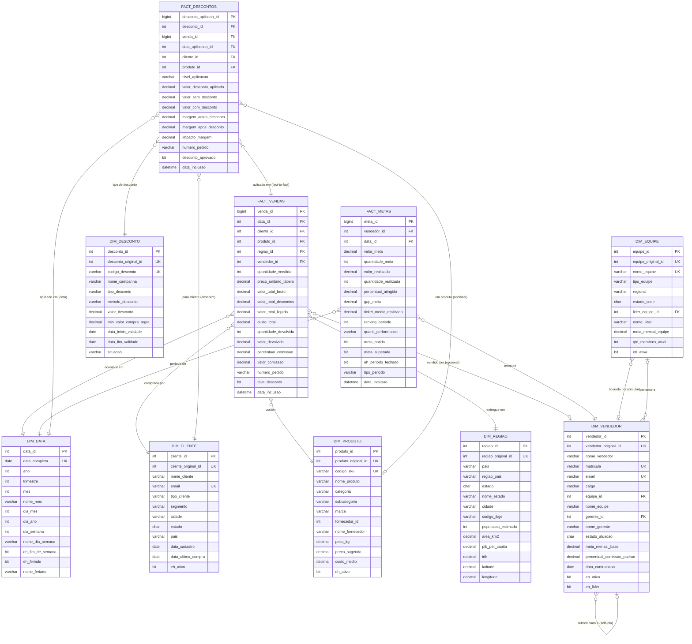
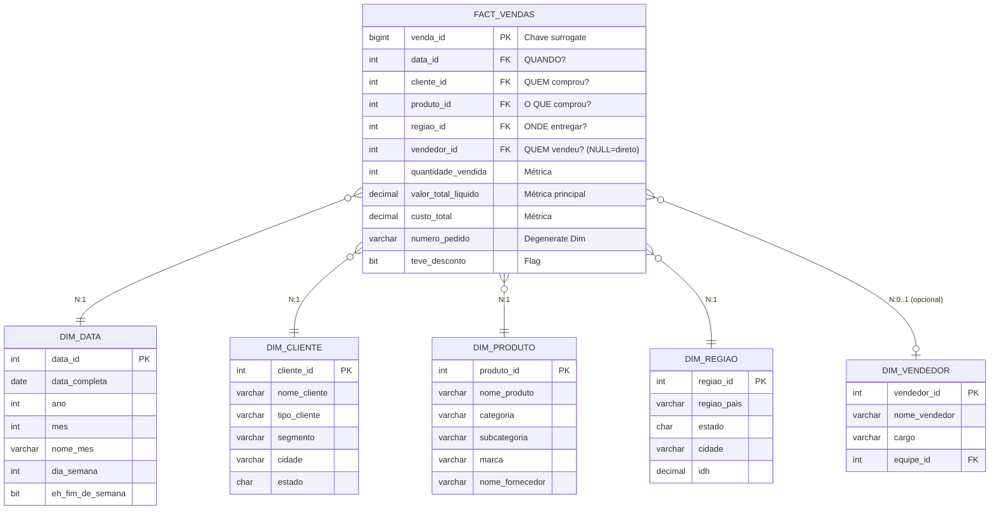
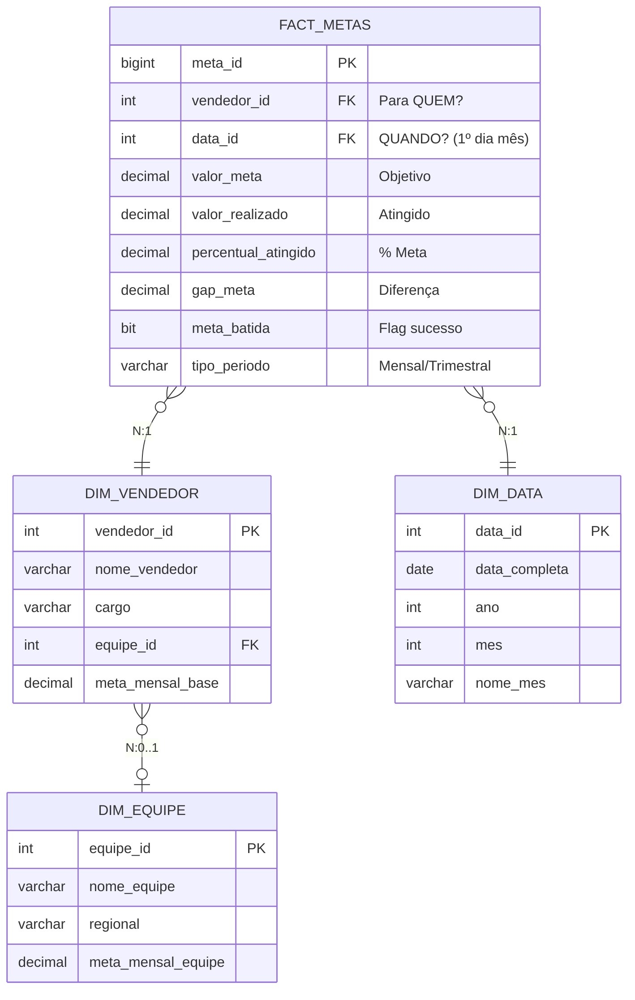
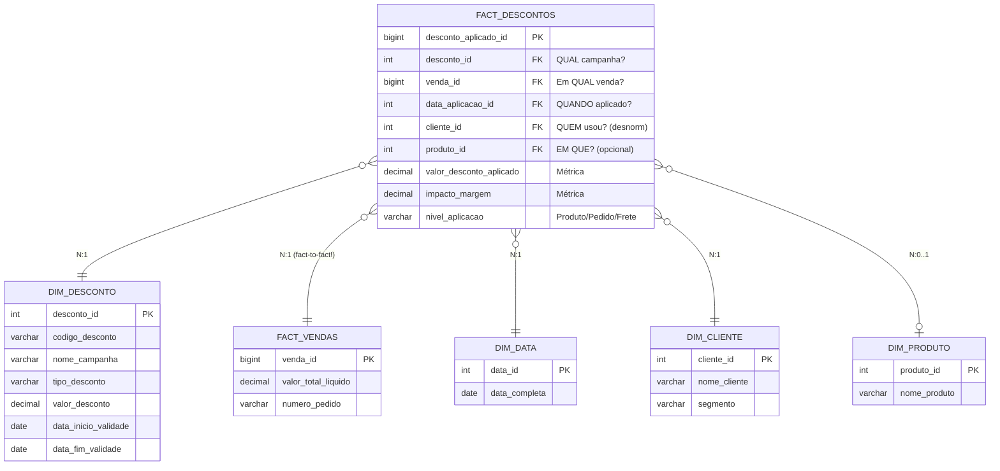
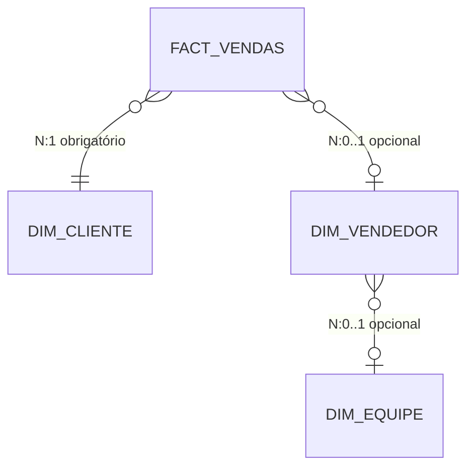
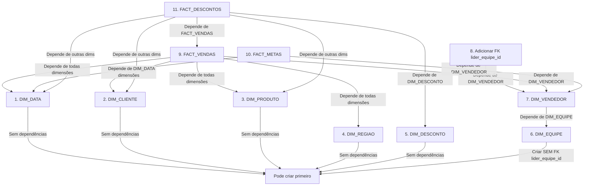
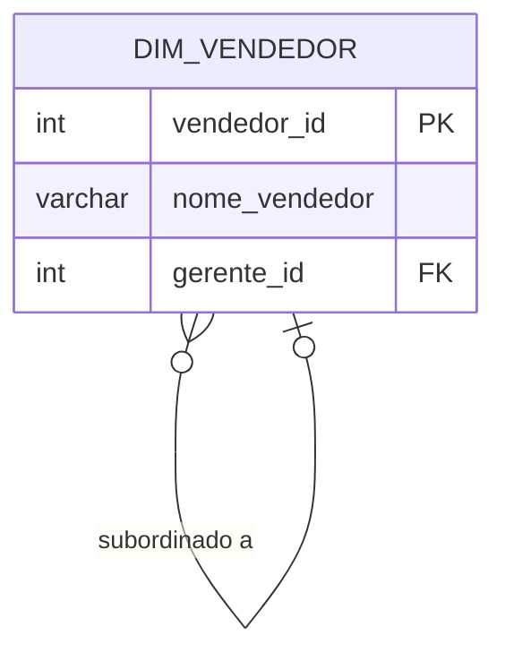
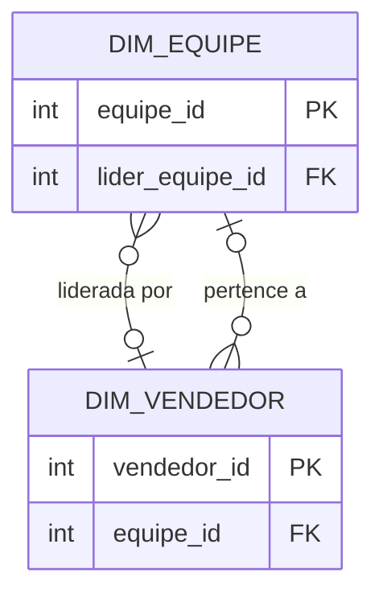
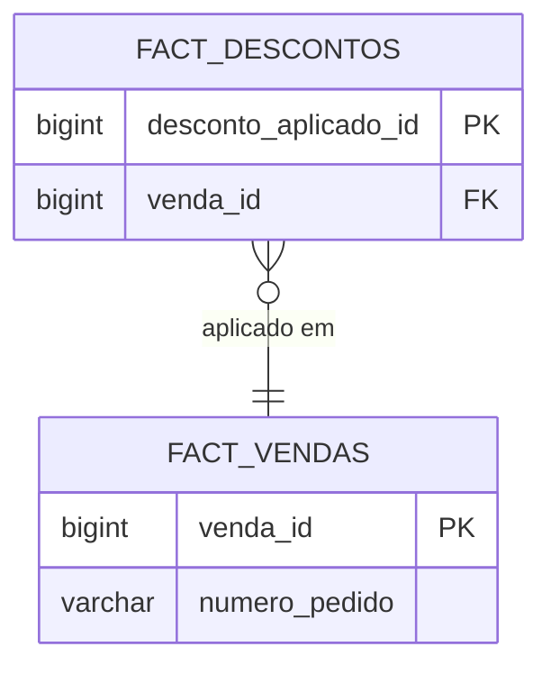

# 🗺️ Diagrama Entidade-Relacionamento (ER)

> Modelo visual completo do Data Warehouse E-commerce

## 📋 Índice

- [Diagrama Completo (Star Schema)](#diagrama-completo-star-schema)
- [Diagrama por Processo de Negócio](#diagrama-por-processo-de-negócio)
- [Relacionamentos Detalhados](#relacionamentos-detalhados)
- [Cardinalidades](#cardinalidades)
- [Dependências e Ordem de Criação](#dependências-e-ordem-de-criação)
- [Legenda](#legenda)

---

## 🌟 Diagrama Completo (Star Schema)

### Visão Geral - Todas as Tabelas



---

## 📊 Diagrama por Processo de Negócio

### 1️⃣ Processo: Vendas Transacionais



**Granularidade:** 1 linha = 1 item vendido em 1 pedido  
**Tipo:** Transaction Fact Table  
**Volume:** Alto (milhões de registros)

---

### 2️⃣ Processo: Gestão de Metas



**Granularidade:** 1 linha = 1 meta de 1 vendedor em 1 período  
**Tipo:** Periodic Snapshot Fact Table  
**Volume:** Baixo/Médio (controlado)

**Constraint Único:**
```sql
UNIQUE (vendedor_id, data_id, tipo_periodo)
-- Garante: 1 vendedor não tem 2 metas no mesmo período
```

---

### 3️⃣ Processo: Descontos e Campanhas



**Granularidade:** 1 linha = 1 desconto aplicado em 1 venda  
**Tipo:** Transaction Fact Table  
**Volume:** Variável (depende de campanhas)

**Relacionamento Especial:**
- ⚠️ **FACT-to-FACT:** `FACT_DESCONTOS.venda_id` → `FACT_VENDAS.venda_id`
- Permite múltiplos descontos por venda

---

## 🔗 Relacionamentos Detalhados

### Matriz de Relacionamentos

| De → Para | Tipo | Cardinalidade | Obrigatório? | Descrição |
|-----------|------|---------------|--------------|-----------|
| **FACT_VENDAS → DIM_DATA** | FK | N:1 | ✅ Sim | Cada venda acontece em uma data |
| **FACT_VENDAS → DIM_CLIENTE** | FK | N:1 | ✅ Sim | Cada venda tem um comprador |
| **FACT_VENDAS → DIM_PRODUTO** | FK | N:1 | ✅ Sim | Cada item vendido é um produto |
| **FACT_VENDAS → DIM_REGIAO** | FK | N:1 | ✅ Sim | Cada venda tem destino de entrega |
| **FACT_VENDAS → DIM_VENDEDOR** | FK | N:0..1 | ❌ Não | Venda pode não ter vendedor (e-commerce direto) |
| **FACT_METAS → DIM_VENDEDOR** | FK | N:1 | ✅ Sim | Cada meta pertence a um vendedor |
| **FACT_METAS → DIM_DATA** | FK | N:1 | ✅ Sim | Cada meta é de um período específico |
| **FACT_DESCONTOS → DIM_DESCONTO** | FK | N:1 | ✅ Sim | Cada desconto aplicado é de uma campanha |
| **FACT_DESCONTOS → FACT_VENDAS** | FK | N:1 | ✅ Sim | Desconto aplicado em uma venda específica |
| **FACT_DESCONTOS → DIM_DATA** | FK | N:1 | ✅ Sim | Data de aplicação do desconto |
| **FACT_DESCONTOS → DIM_CLIENTE** | FK | N:1 | ✅ Sim | Cliente que usou o desconto (desnormalizado) |
| **FACT_DESCONTOS → DIM_PRODUTO** | FK | N:0..1 | ❌ Não | Produto com desconto (NULL se for desconto no pedido/frete) |
| **DIM_VENDEDOR → DIM_EQUIPE** | FK | N:0..1 | ❌ Não | Vendedor pode estar sem equipe temporariamente |
| **DIM_VENDEDOR → DIM_VENDEDOR** | FK (self) | N:0..1 | ❌ Não | Hierarquia gerencial (gerente_id) |
| **DIM_EQUIPE → DIM_VENDEDOR** | FK | 1:0..1 | ❌ Não | Líder da equipe (circular reference) |

---

## 📏 Cardinalidades

### Notação Utilizada

```
Símbolo │ Significado
────────┼─────────────────────────
  ||    │ Exatamente 1 (obrigatório)
  |o    │ Zero ou 1 (opcional)
  }|    │ Muitos (N)
  }o    │ Zero ou muitos
```

### Exemplos de Leitura



**Interpretação:**

1. **FACT_VENDAS }o--|| DIM_CLIENTE**
   - "Muitas vendas (N) pertencem a exatamente 1 cliente"
   - FK obrigatória (NOT NULL)

2. **FACT_VENDAS }o--o| DIM_VENDEDOR**
   - "Muitas vendas (N) podem ter 0 ou 1 vendedor"
   - FK opcional (NULL permitido)

3. **DIM_VENDEDOR }o--o| DIM_EQUIPE**
   - "Muitos vendedores (N) podem pertencer a 0 ou 1 equipe"
   - Vendedor pode estar sem equipe

---

## 🏗️ Dependências e Ordem de Criação

### Grafo de Dependências



### Ordem Correta de Execução

```sql
-- ═══════════════════════════════════════════════
-- ETAPA 1: Dimensões independentes (sem FKs)
-- ═══════════════════════════════════════════════
CREATE TABLE dim.DIM_DATA (...);
CREATE TABLE dim.DIM_CLIENTE (...);
CREATE TABLE dim.DIM_PRODUTO (...);
CREATE TABLE dim.DIM_REGIAO (...);
CREATE TABLE dim.DIM_DESCONTO (...);

-- ═══════════════════════════════════════════════
-- ETAPA 2: DIM_EQUIPE SEM FK circular
-- ═══════════════════════════════════════════════
CREATE TABLE dim.DIM_EQUIPE (
    equipe_id INT PRIMARY KEY,
    lider_equipe_id INT NULL  -- SEM FK ainda!
    -- ... outros campos
);

-- ═══════════════════════════════════════════════
-- ETAPA 3: DIM_VENDEDOR (depende de DIM_EQUIPE)
-- ═══════════════════════════════════════════════
CREATE TABLE dim.DIM_VENDEDOR (
    vendedor_id INT PRIMARY KEY,
    equipe_id INT,
    gerente_id INT,  -- self-join
    CONSTRAINT FK_VENDEDOR_equipe 
        FOREIGN KEY (equipe_id) REFERENCES dim.DIM_EQUIPE(equipe_id),
    CONSTRAINT FK_VENDEDOR_gerente 
        FOREIGN KEY (gerente_id) REFERENCES dim.DIM_VENDEDOR(vendedor_id)
);

-- ═══════════════════════════════════════════════
-- ETAPA 4: Adicionar FK circular em DIM_EQUIPE
-- ═══════════════════════════════════════════════
ALTER TABLE dim.DIM_EQUIPE
ADD CONSTRAINT FK_EQUIPE_lider 
    FOREIGN KEY (lider_equipe_id) 
    REFERENCES dim.DIM_VENDEDOR(vendedor_id);

-- ═══════════════════════════════════════════════
-- ETAPA 5: FACT_VENDAS (depende de todas dims)
-- ═══════════════════════════════════════════════
CREATE TABLE fact.FACT_VENDAS (...);

-- ═══════════════════════════════════════════════
-- ETAPA 6: FACT_METAS (depende de VENDEDOR e DATA)
-- ═══════════════════════════════════════════════
CREATE TABLE fact.FACT_METAS (...);

-- ═══════════════════════════════════════════════
-- ETAPA 7: FACT_DESCONTOS (depende de FACT_VENDAS!)
-- ═══════════════════════════════════════════════
CREATE TABLE fact.FACT_DESCONTOS (...);
```

---

## 🎨 Legenda

### Tipos de Relacionamento

| Símbolo | Descrição |
|---------|-----------|
| `}o--||` | Muitos-para-Um (N:1) obrigatório |
| `}o--o|` | Muitos-para-Zero-ou-Um (N:0..1) opcional |
| `||--||` | Um-para-Um (1:1) |
| `}o--o{` | Muitos-para-Muitos (N:M) - evitado em Star Schema |

### Tipos de Chave

| Marcador | Descrição |
|----------|-----------|
| **PK** | Primary Key (Chave Primária) |
| **FK** | Foreign Key (Chave Estrangeira) |
| **UK** | Unique Key (Chave Única) |

### Tipos de Tabela

| Prefixo | Tipo | Descrição |
|---------|------|-----------|
| **DIM_** | Dimensão | Descreve contexto (quem, o que, onde, quando) |
| **FACT_** | Fato | Armazena métricas e eventos mensuráveis |

### Cores no Diagrama (se renderizado)

- 🔵 **Azul:** Dimensões
- 🟢 **Verde:** Tabelas Fato
- 🟡 **Amarelo:** Relacionamentos especiais (self-join, circular, fact-to-fact)

---

## 📊 Estatísticas do Modelo

| Métrica | Valor |
|---------|-------|
| **Total de Tabelas** | 10 (7 dims + 3 facts) |
| **Total de FKs** | 15 |
| **FKs em FACT_VENDAS** | 5 |
| **FKs em FACT_METAS** | 2 |
| **FKs em FACT_DESCONTOS** | 5 (incluindo 1 fact-to-fact) |
| **FKs entre Dimensões** | 3 (1 transitiva + 1 self-join + 1 circular) |
| **Relacionamentos Opcionais (NULL)** | 5 |
| **Relacionamentos Obrigatórios (NOT NULL)** | 10 |

---

## 🔍 Relacionamentos Especiais

### 1️⃣ Self-Join (Hierarquia Gerencial)



**Uso:**
```sql
-- Hierarquia completa (3 níveis)
SELECT 
    v1.nome_vendedor AS vendedor,
    v2.nome_vendedor AS gerente,
    v3.nome_vendedor AS gerente_do_gerente
FROM dim.DIM_VENDEDOR v1
LEFT JOIN dim.DIM_VENDEDOR v2 ON v1.gerente_id = v2.vendedor_id
LEFT JOIN dim.DIM_VENDEDOR v3 ON v2.gerente_id = v3.vendedor_id;
```

---

### 2️⃣ Relacionamento Circular (DIM_EQUIPE ↔ DIM_VENDEDOR)



**Problema:** Deadlock de criação!

**Solução:** Criar em 3 etapas (ver seção "Ordem de Criação")

---

### 3️⃣ Fact-to-Fact (FACT_DESCONTOS → FACT_VENDAS)



**Por quê?** Uma venda pode ter múltiplos descontos:
```
Venda #123:
├─ Desconto 1: BLACKFRIDAY (-10%)
├─ Desconto 2: VOLUME (-5%)
└─ Desconto 3: FRETE_GRATIS (-R$30)
```

---

## 📚 Referências

- **[Modelagem Completa](../modelagem/02_dimensoes.md)** - Detalhes de todas as dimensões
- **[Tabelas Fato](../modelagem/03_fatos.md)** - Especificação das facts
- **[Relacionamentos](../modelagem/04_relacionamentos.md)** - Mapa de FKs e integridade
- **[Dicionário de Dados](../modelagem/05_dicionario_dados.md)** - Catálogo de campos

---

## 🛠️ Como Usar Este Diagrama

### Visualizar no GitHub
Os diagramas Mermaid são renderizados automaticamente no GitHub. Basta abrir este arquivo `.md` no repositório.

### Exportar como Imagem
1. Copie o código Mermaid
2. Cole em: https://mermaid.live/
3. Exporte como PNG/SVG

### Ferramentas de Modelagem
- **dbdiagram.io** - Converter para DBDiagram
- **draw.io** - Importar e customizar
- **Lucidchart** - Diagramas profissionais

---

<div align="center">

**[⬆ Voltar ao topo](#-diagrama-entidade-relacionamento-er)**

*Diagrama gerado seguindo metodologia Kimball - Star Schema*  
*Última atualização: Janeiro 2026*

</div>
