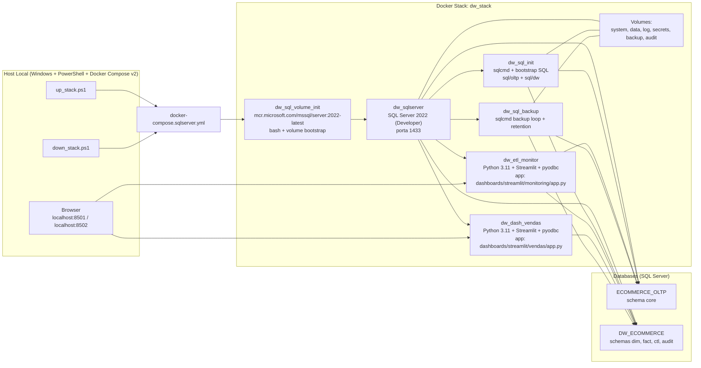
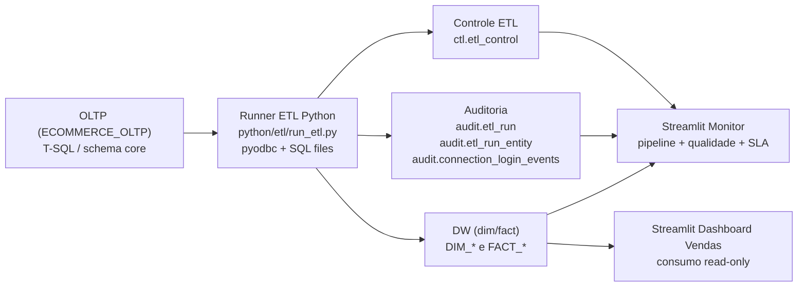

# Arquitetura Atual Do Projeto

Diagrama da arquitetura operacional atual, com foco em componentes executaveis e tecnologias utilizadas.

## Visao De Runtime (Docker-First)

## Fluxo De Dados ETL

## Tecnologias Por Camada

| Camada | Tecnologias |
|---|---|
| Orquestracao | Docker Compose v2, PowerShell (`up_stack.ps1`, `down_stack.ps1`) |
| Banco de dados | SQL Server 2022 (Developer), T-SQL, `sqlcmd` |
| ETL | Python 3.11, `pyodbc`, ODBC Driver 18, SQL parametrizado em arquivos |
| Monitoramento | Streamlit (`dashboards/streamlit/monitoring/app.py`), tabelas `audit.*` |
| Consumo BI | Streamlit (`dashboards/streamlit/vendas/app.py`), usuario `bi_reader` |
| Seguranca e acesso | logins SQL (`sa`, `etl_monitor`, `etl_backup`, `bi_reader`) |
| Backup e retencao | job continuo em container (`dw_sql_backup`), arquivos `.bak`, limpeza por idade |

## Observacoes

- Esta visao representa o estado atual do `docker/docker-compose.sqlserver.yml`.
- O dashboard de vendas esta apontado para `dashboards/streamlit/vendas/` (nao `python/dashboards/vendas/`).
