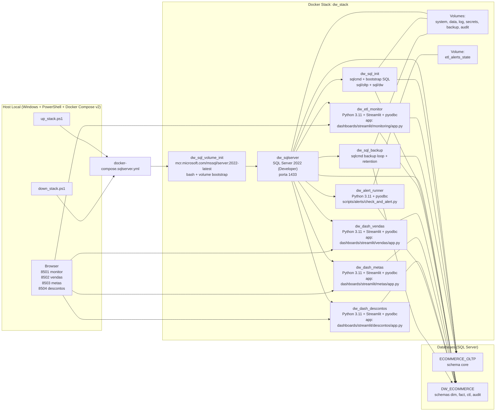
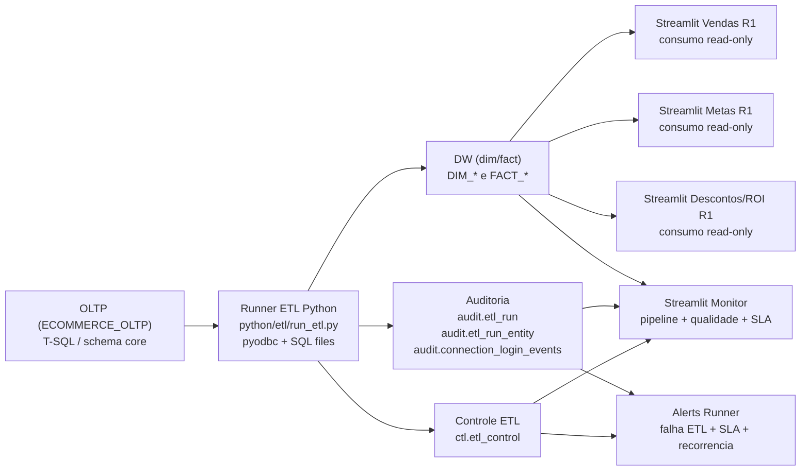

# Arquitetura Atual Do Projeto

Diagrama da arquitetura operacional atual, com foco em componentes executaveis e tecnologias utilizadas.

## Visao De Runtime (Docker-First)

```mermaid
flowchart LR
    subgraph HOST["Host Local (Windows + PowerShell + Docker Compose v2)"]
        UP["up_stack.ps1"]
        DOWN["down_stack.ps1"]
        BROWSER["Browser<br/>8501 monitor<br/>8502 vendas<br/>8503 metas<br/>8504 descontos"]
    end

    UP --> COMPOSE["docker-compose.sqlserver.yml"]
    DOWN --> COMPOSE

    subgraph STACK["Docker Stack: dw_stack"]
        VINIT["dw_sql_volume_init<br/>mcr.microsoft.com/mssql/server:2022-latest<br/>bash + volume bootstrap"]
        SQL["dw_sqlserver<br/>SQL Server 2022 (Developer)<br/>porta 1433"]
        INIT["dw_sql_init<br/>sqlcmd + bootstrap SQL<br/>sql/oltp + sql/dw"]
        MON["dw_etl_monitor<br/>Python 3.11 + Streamlit + pyodbc<br/>app: dashboards/streamlit/monitoring/app.py"]
        DASHV["dw_dash_vendas<br/>Python 3.11 + Streamlit + pyodbc<br/>app: dashboards/streamlit/vendas/app.py"]
        DASHM["dw_dash_metas<br/>Python 3.11 + Streamlit + pyodbc<br/>app: dashboards/streamlit/metas/app.py"]
        DASHD["dw_dash_descontos<br/>Python 3.11 + Streamlit + pyodbc<br/>app: dashboards/streamlit/descontos/app.py"]
        ALERT["dw_alert_runner<br/>Python 3.11 + pyodbc<br/>scripts/alerts/check_and_alert.py"]
        BACKUP["dw_sql_backup<br/>sqlcmd backup loop + retention"]
        VOLS["Volumes:<br/>system, data, log, secrets, backup, audit"]
        AVOL["Volume:<br/>etl_alerts_state"]
    end

    subgraph DBS["Databases (SQL Server)"]
        OLTP["ECOMMERCE_OLTP<br/>schema core"]
        DW["DW_ECOMMERCE<br/>schemas dim, fact, ctl, audit"]
    end

    COMPOSE --> VINIT --> SQL
    SQL --> INIT
    SQL --> MON
    SQL --> DASHV
    SQL --> DASHM
    SQL --> DASHD
    SQL --> ALERT
    SQL --> BACKUP

    SQL --- VOLS
    INIT --- VOLS
    BACKUP --- VOLS
    ALERT --- AVOL

    SQL --> OLTP
    SQL --> DW

    INIT --> OLTP
    INIT --> DW
    MON --> OLTP
    MON --> DW
    DASHV --> DW
    DASHM --> DW
    DASHD --> DW
    ALERT --> DW
    BACKUP --> OLTP
    BACKUP --> DW

    BROWSER --> MON
    BROWSER --> DASHV
    BROWSER --> DASHM
    BROWSER --> DASHD
```

## Fluxo De Dados ETL

```mermaid
flowchart LR
    SRC["OLTP (ECOMMERCE_OLTP)<br/>T-SQL / schema core"]
    ETL["Runner ETL Python<br/>python/etl/run_etl.py<br/>pyodbc + SQL files"]
    CTRL["Controle ETL<br/>ctl.etl_control"]
    AUD["Auditoria<br/>audit.etl_run<br/>audit.etl_run_entity<br/>audit.connection_login_events"]
    DW["DW (dim/fact)<br/>DIM_* e FACT_*"]
    MON["Streamlit Monitor<br/>pipeline + qualidade + SLA"]
    BIV["Streamlit Vendas R1<br/>consumo read-only"]
    BIM["Streamlit Metas R1<br/>consumo read-only"]
    BID["Streamlit Descontos/ROI R1<br/>consumo read-only"]
    ALERT["Alerts Runner<br/>falha ETL + SLA + recorrencia"]

    SRC --> ETL --> DW
    ETL --> CTRL
    ETL --> AUD
    CTRL --> MON
    AUD --> MON
    DW --> MON
    DW --> BIV
    DW --> BIM
    DW --> BID
    CTRL --> ALERT
    AUD --> ALERT
```

## Tecnologias Por Camada

| Camada | Tecnologias |
|---|---|
| Orquestracao | Docker Compose v2, PowerShell (`up_stack.ps1`, `down_stack.ps1`) |
| Banco de dados | SQL Server 2022 (Developer), T-SQL, `sqlcmd` |
| ETL | Python 3.11, `pyodbc`, ODBC Driver 18, SQL parametrizado em arquivos |
| Monitoramento | Streamlit (`dashboards/streamlit/monitoring/app.py`), tabelas `audit.*` |
| Consumo BI | Streamlit (`vendas`, `metas`, `descontos`), usuario `bi_reader`, modo SQL e snapshot |
| Alertas | `scripts/alerts/check_and_alert.py`, webhook Discord, estado persistido em volume |
| Seguranca e acesso | logins SQL (`sa`, `etl_monitor`, `etl_backup`, `bi_reader`) |
| Backup e retencao | job continuo em container (`dw_sql_backup`), arquivos `.bak`, limpeza por idade |

## Observacoes

- Esta visao representa o estado atual do `docker/docker-compose.sqlserver.yml`.
- Os dashboards de negocio estao em `dashboards/streamlit/{vendas,metas,descontos}`.
- O deploy externo de portfolio ainda esta em andamento no plano de fechamento (`docs/produto/PLANO_FECHAMENTO_PORTFOLIO_MVP.md`).
