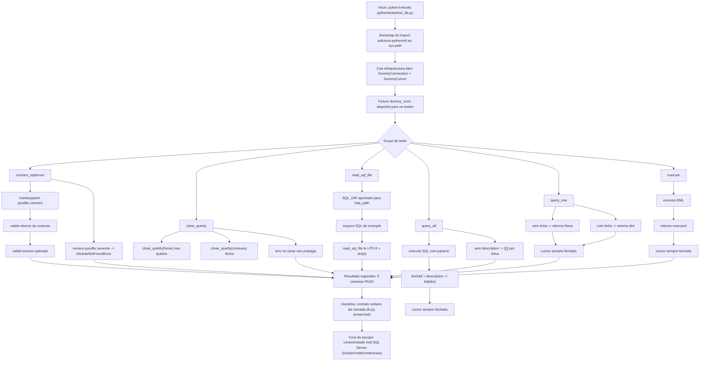
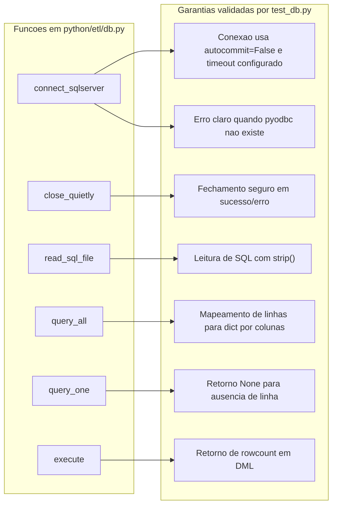

# Fluxo Dos Testes Unitarios De DB

Este diagrama documenta o fluxo da suite `python/tests/test_db.py`, mostrando:

- preparacao do ambiente de teste (dubles e monkeypatch);
- cenarios cobertos por funcao;
- garantias obtidas em cada grupo de testes;
- limite do escopo (nao valida conexao real com SQL Server).

## Fluxo Geral Da Execucao



## Mapa De Garantias Por Funcao



## Comando Para Visualizar O Fluxo Na Pratica

```powershell
python -m pytest -q python/tests/test_db.py
```

