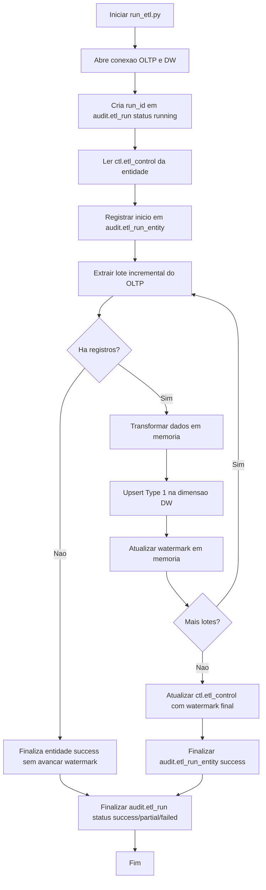
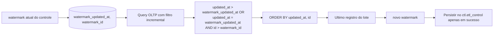
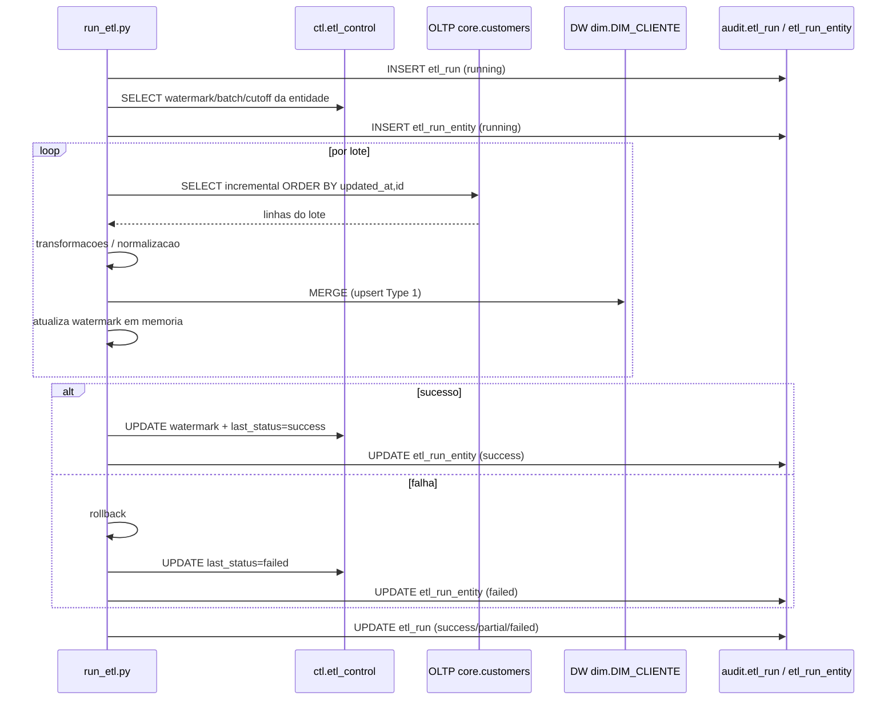
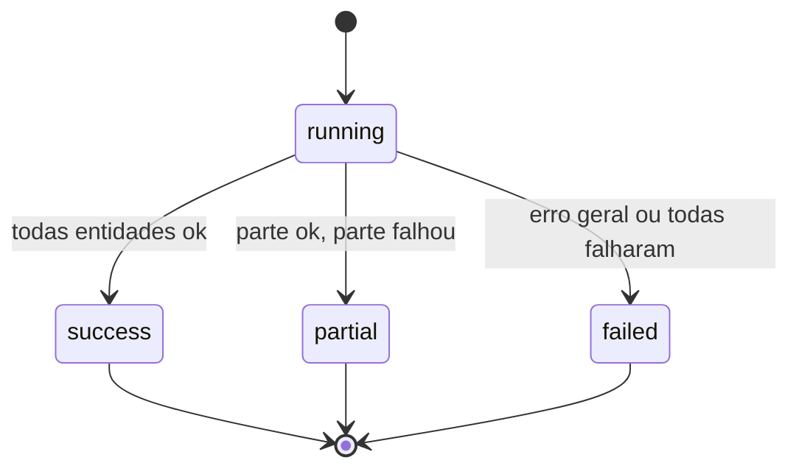
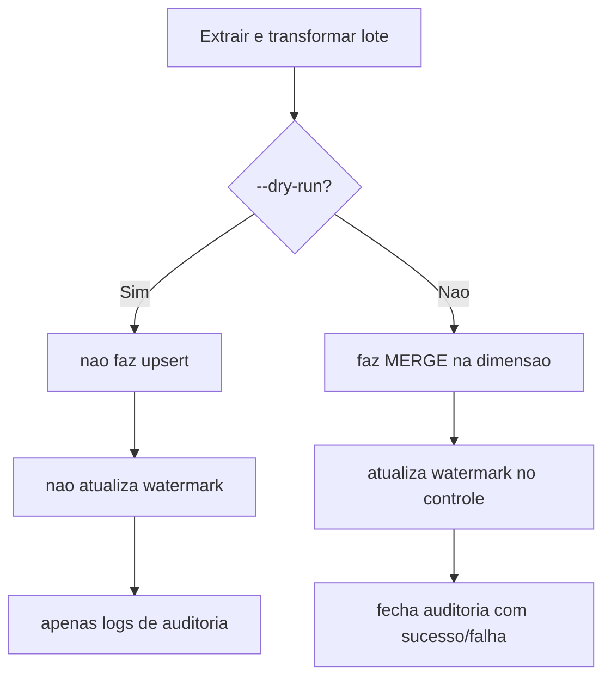

# Fluxo Visual do ETL (Fase 3)

Este documento traduz o fluxo da Fase 3 para diagramas.

## 1) Fluxo principal (alto nivel)

## 2) Logica incremental (watermark composto)

## 3) Sequencia entre componentes

## 4) Estados de execucao

## 5) Dry-run vs execucao real

